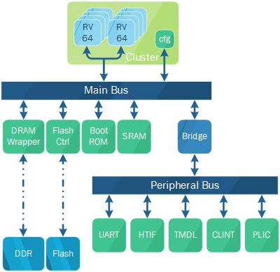

# RISC-V Simulator

## Environment
- Ubuntu 18.04.1 LTS (GNU/Linux 4.15.0-34-generic x86\_64)

## Prerequisite
- g++ 7.4.0

## Processor extension implementation
- RV64IMACFD

## Compile
```shell
$ make
```

## Block diagram


- Introduce all slave on bus  

|Slave   |Base Address    |Size    |Read&Write|Cacheable|
|:------:|:--------------:|:------:|:--------:|:-------:|
|Boot ROM|0x0\_0000\_0000 |  32 KB | RO       | Y       |
|SRAM0   |0x0\_0001\_0000 |  64 KB | RW       | Y       |
|SRAM1   |0x0\_0002\_0000 |  64 KB | RW       | Y       |
|Cluster |0x0\_0004\_0000 |   4 KB | RW       | N       |
|Bridge  |0x0\_1000\_0000 | 256 MB | RW       | N       |
|UART    |0x0\_1000\_1000 |   4 KB | RW       | N       |
|HTIF    |0x0\_1000\_2000 |   4 KB | RW       | N       |
|TMDL    |0x0\_1000\_3000 |   4 KB | RW       | N       |
|\*CLINT |0x0\_1001\_0000 |  64 KB | RW       | N       |
|\*PLIC  |0x0\_1400\_0000 |  64 MB | RW       | N       |
|DDR0    |0x0\_2000\_0000 |   8 MB | RW       | Y       |
|DDR1    |0x0\_8000\_0000 |   8 MB | RW       | Y       |
|FLASH   |0x1\_0000\_0000 |   1 GB | RW       | Y       |

-- \*CLINT: Core-local Interrupt Controller
-- \*PLIC: Platform Level Interrupt Controller

- Also you can modify those configuration throgh rewrite `main/main.cpp`
## Usage
- We provide `prog0`~`prog10` test program that you can check processor is correct or not
- You can use makefile to exacute simulator. e.g.

```=sh
make sim prog=0
```


## Authors
[Yu-Tong Shen](https://github.com/yutongshen/)

###### tags: `RISC-V`
